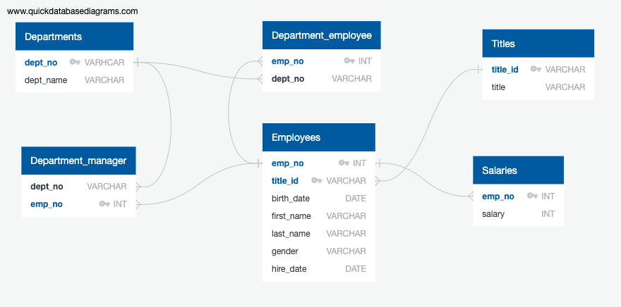

# SQL Homework - Employee Database: A Mystery in Two Parts

## Background

It is a beautiful spring day, and it is two weeks since you have been hired as a new data engineer at Pewlett Hackard. Your first major task is a research project on employees of the corporation from the 1980s and 1990s. All that remain of the database of employees from that period are six CSV files.

In this assignment, you will design the tables to hold data in the CSVs, import the CSVs into a SQL database, and answer questions about the data. In other words, you will perform:

1. Data Modeling
2. Data Engineering
3. Data Analysis

## Submission

### Data Modeling


### Data Engineering
* Use the information to create a table schema for each of the six CSV files. Remember to specify data types, primary keys, foreign keys, and other constraints.
* Import each CSV file into the corresponding SQL table.

```
--Use the information you have to create a table schema for each of the six CSV files. Remember to specify data types, primary keys, foreign keys, and other constraints.
--Import each CSV file into the corresponding SQL table.
drop table Employees;
drop table Departments;
drop table Department_Employee;
drop table Department_Manager;
drop table Salaries;
drop table Titles;

CREATE TABLE Titles (
	title_id VARCHAR NOT NULL,
	title VARCHAR NOT NULL,
		PRIMARY KEY (title_id)
);
SELECT * FROM Titles;

CREATE TABLE Employees (
	emp_no INT NOT NULL,
	title_id VARCHAR NOT NULL,
	birth_date DATE NOT NULL,
	first_name VARCHAR NOT NULL,
	last_name VARCHAR NOT NULL,
	gender VARCHAR NOT NULL,
	hire_date DATE NOT NULL,
		PRIMARY KEY (emp_no),
		FOREIGN KEY (title_id) REFERENCES Titles(title_id)
);
SELECT * FROM Employees;

CREATE TABLE Departments (
	dept_no VARCHAR NOT NULL,
	dept_name VARCHAR NOT NULL,
		PRIMARY KEY (dept_no)
);
SELECT * FROM Departments

CREATE TABLE Department_employee (
	emp_no INT NOT NULL,
	dept_no VARCHAR NOT NULL,
		FOREIGN KEY (emp_no) REFERENCES Employees(emp_no),
		FOREIGN KEY (dept_no) REFERENCES Departments(dept_no)
);
SELECT * FROM Department_employee;

CREATE TABLE Department_manager (
	dept_no VARCHAR NOT NULL,
	emp_no INT NOT NULL,
		FOREIGN KEY (emp_no) REFERENCES Employees(emp_no),
		FOREIGN KEY (dept_no) REFERENCES Departments(dept_no)
);
SELECT * FROM Department_manager;

CREATE TABLE Salaries (
	emp_no INT NOT NULL,
	salary INT NOT NULL,
		FOREIGN KEY (emp_no) REFERENCES Employees(emp_no)
);
SELECT * FROM Salaries;
```

### Data Analysis
Once there is a complete database, do the following:

--1. List the following details of each employee: employee number, last name, first name, sex, and salary.
```
SELECT Employees.emp_no, Employees.last_name, Employees.first_name, Employees.gender, Salaries.salary
FROM Employees
INNER JOIN Salaries ON
Employees.emp_no = Salaries.emp_no;
```

--2. List first name, last name, and hire date for employees who were hired in 1986.
```
SELECT first_name, last_name, hire_date
FROM Employees
WHERE hire_date >= '1985-12-31'
AND hire_date < '1987-01-01';
```

--3. List the manager of each department with the following information: 
--department number, department name, the manager's employee number, last name, first name.
```
SELECT Department_manager.dept_no, Departments.dept_name, Department_manager.emp_no,Employees.last_name, Employees.first_name
FROM Departments
INNER JOIN Department_manager ON
Department_manager.dept_no = Departments.dept_no
INNER JOIN Employees ON
Employees.emp_no = Department_manager.emp_no;
```

--4. List the department of each employee with the following information: 
--employee number, last name, first name, and department name.
```
SELECT Employees.emp_no, Employees.last_name, Employees.first_name, Departments.dept_name
FROM Department_employee
JOIN Employees ON
Department_employee.emp_no = Employees.emp_no
JOIN Departments ON
Department_employee.dept_no = Departments.dept_no;
```

--5. List first name, last name, and sex for employees whose 
--first name is "Hercules" and last names begin with "B."
```
SELECT * FROM Employees
WHERE first_name = 'Hercules'
AND last_name LIKE 'B%';
```

--6. List all employees in the Sales department, 
--including their employee number, last name, first name, and department name.
```
SELECT Employees.emp_no, Employees.last_name, Employees.first_name, Departments.dept_name
FROM Employees
JOIN Department_employee ON
Department_employee.emp_no = Employees.emp_no
INNER JOIN Departments ON
Department_employee.dept_no = Departments.dept_no
WHERE dept_name = 'Sales';
```

--7.List all employees in the Sales and Development departments, 
--including their employee number, last name, first name, and department name.
```
SELECT Employees.emp_no, Employees.last_name, Employees.first_name, Departments.dept_name
FROM Employees
JOIN Department_employee ON
Department_employee.emp_no = Employees.emp_no
INNER JOIN Departments ON
Department_employee.dept_no = Departments.dept_no
WHERE dept_name = 'Sales' OR
	dept_name = 'Development';
```

--8. In descending order, list the frequency count of employee last names, 
--i.e., how many employees share each last name.
```
SELECT last_name, COUNT(last_name) FROM Employees
GROUP BY last_name
ORDER BY count(last_name) desc;
```
